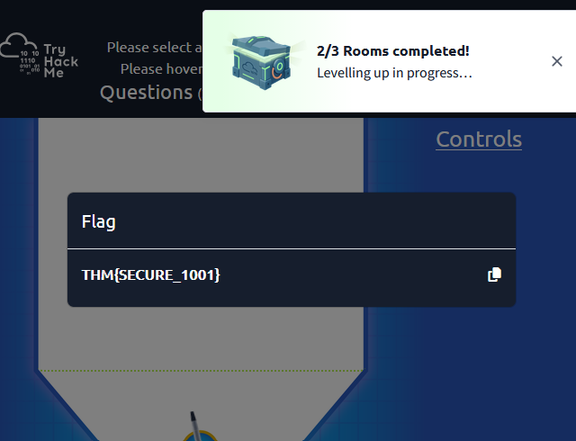
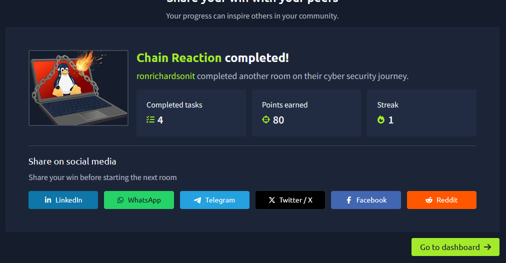

# Healthcare AI Vendor Risk Assessment & Supply Chain Governance

**Ron Richardson | Healthcare GRC & IAM Portfolio — Project 2**

A fictional procurement assessment of **CogniScribe AI**, an ambient clinical documentation service that converts encounter audio into draft SOAP notes for clinician review and EHR integration. The assessment connects software supply-chain investigation lessons to evidence requests, clinical-data safeguards and procurement decisions.

## Technical foundation

| Governance & Regulation — final exercise | Chain Reaction — completion |
|---|---|
|  |  |
| Room completion reported by Ron; image captures final exercise flag | Screenshot confirms four tasks completed and 80 points earned |

The lab identified Axios 1.14.1 with a suspicious typing-coreutils 1.6.4 dependency and an installation hook invoking `node postinst.js`. Consolidated investigation notes describe an obfuscated downloader, HTTP C2 and shell-profile persistence. These findings motivate vendor review questions; they do not establish a CogniScribe AI compromise.

See the [technical evidence record](docs/Technical_Evidence_Record.md) for screenshots, artifact values and distinctions between captured output and consolidated notes.

## Portfolio deliverables

| Document | Purpose |
|---|---|
| [Vendor security questionnaire](docs/Vendor_Security_Questionnaire.md) | Twenty evidence requests covering clinical AI, subprocessors, supply chain and operations |
| [Evidence-gap risk register](docs/Evidence_Gap_Risk_Register.md) | Ten risk scenarios, evidence gaps, scoring assumptions and risk-specific closure criteria |
| [Control objectives and evidence gates](docs/Control_Gap_Assessment.md) | Access, asset/data, incident and supply-chain objectives with artifacts and acceptance tests |
| [Executive procurement memo](docs/Executive_Recommendation_Memo.md) | CISO/committee recommendation and five groups of pre-production conditions |
| [Technical evidence record](docs/Technical_Evidence_Record.md) | Training provenance and investigation evidence |

## Assessment boundary

**Procurement position:** synthetic-data evaluation only; production integration withheld. All vendor assurance is pending. Missing vendor evidence is an evidence gap, not proof of a failed control. Projected residual scores are conditional targets; no risk reduction is credited before effectiveness review and owner acceptance.

This is a fictional Tier-1 service handling highly sensitive clinical information. HIPAA and applicable Part 2 obligations guide review; NIST CSF 2.0 and AI RMF inform governance. No real patient data or vendor controls were assessed. Production approval is withheld pending evidence and owner decisions; synthetic-data evaluation is the proposed next step. Detailed risk analysis belongs in the register and approval terms in the memo.

## Repository structure

```text
README.md
docs/
  Vendor_Security_Questionnaire.md
  Evidence_Gap_Risk_Register.md
  Executive_Recommendation_Memo.md
  Technical_Evidence_Record.md
evidence/
  Screenshot_gov_reg_badge.png
  Screenshot_chain_reaction_badge.png
  lab-dependency-version.png
  lab-postinstall-script.png
```
