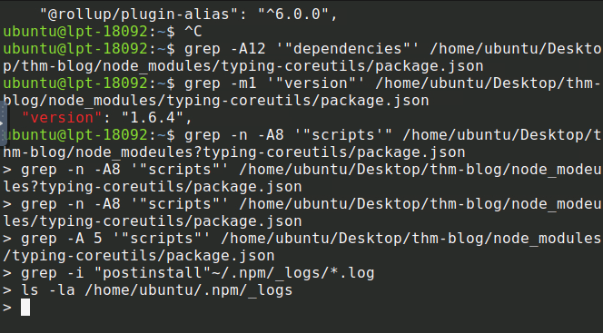
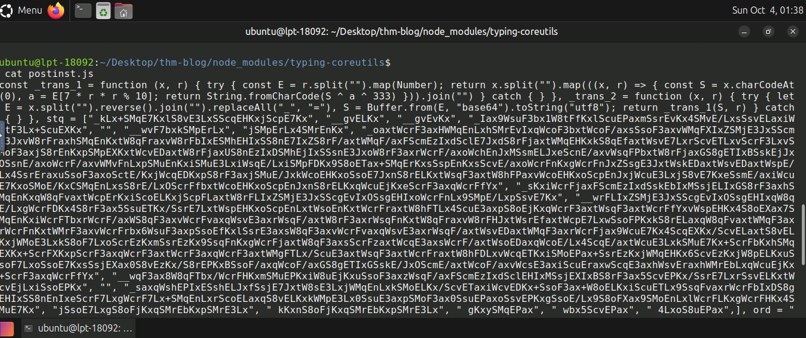

# Technical evidence and provenance

## Training completion
| ID | Artifact | What it establishes |
|---|---|---|
| E01 | [Governance screenshot](Screenshot_gov_reg_badge.png) | Captured final exercise flag; room completion reported by Ron. Screenshot is not a full room progress/export record. |
| E02 | [Chain Reaction screenshot](Screenshot_chain_reaction_badge.png) | Explicit room completion for ronrichardsonit, four tasks and 80 points. |
| E03 | Consolidated user briefing in this chat | Additional forensic findings provided by Ron after working with Gemini; raw artifacts for these were not all supplied. |

## Investigation record
| Artifact / finding | Value | Evidence status |
|---|---|---|
| Axios installed version | 1.14.1 | User terminal output reported in chat |
| Injected dependency | typing-coreutils@1.6.4 | Package manifest/version visible in supplied terminal screenshot |
| Install hook | node postinst.js | User-reported npm-log finding |
| Decoder key | ord = OrDeR_7077 | Consolidated user notes; complete decoder output not retained here |
| C2 | http://sfrquack.thm:8000/1502068 | Gemini decoding relayed by user; consolidated notes |
| Download POST body | pypi.org/latest | Relayed decoded command |
| Initial payload | /tmp/.promise.py | Relayed decoded command; file was absent during subsequent checks |
| Copied payload | /home/ubuntu/.local/apt.conf; masquerade unattended-upgr | Consolidated notes; raw process evidence not supplied here |
| Persistence | ~/.profile; T1546.004 | Consolidated notes; startup modification output not supplied here |

Completion flags are intentionally omitted from this public-ready record. Completion does not prove exfiltration, ePHI access or successful remediation. The earlier python3 server.py process was not established as malicious and is excluded from findings. Historical public incident reports are background, distinct from this modified training scenario.

The technical record supports supply-chain questions and tests. It establishes no actual CogniScribe AI incident. Production-readiness claims require vendor evidence, not lab completion.

Training links: [Governance & Regulation](https://tryhackme.com/room/cybergovernanceregulation), [Chain Reaction](https://tryhackme.com/room/chainreaction-bt). Persistence reference: [MITRE T1546.004](https://attack.mitre.org/techniques/T1546/004/).

## Captured investigation artifacts

### E04 — Installed dependency

Shows version 1.6.4 in the suspicious package's manifest. The later continuation prompts record a command-entry error, not successful log searches.

### E05 — Obfuscated install script

Shows source printed with cat, including the decoding function and encoded strings. The final key assignment is cut off. This artifact corroborates source inspection but does not independently establish the complete decoded command or execution outcome.
